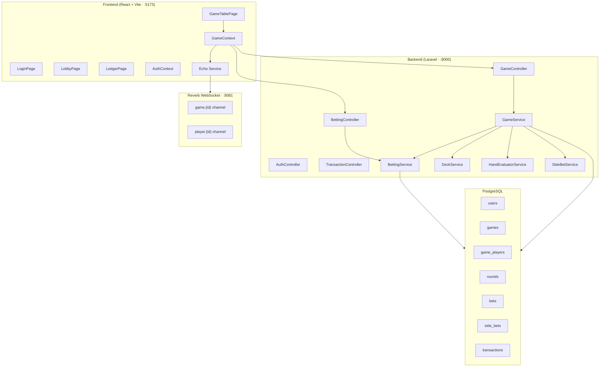

# 🃏 Bet Game (Family Showdown) — Full System Scan

## Project Overview

A real-time **5-Card Draw (Showdown) Poker** web app for family game nights. Physical chips are replaced with a strict **digital ledger** — one trusted family member (Banker) handles physical PHP cash while the app tracks all balances, bets, debts, and payouts.

---

## Tech Stack

| Layer | Technology |
|---|---|
| **Frontend** | React 18 (Vite) + Styled Components + React Router |
| **Backend** | Laravel 11 (PHP 8.2+) + Sanctum (token auth) |
| **Database** | PostgreSQL (`bet_game` on port 5432) |
| **Real-Time** | Laravel Reverb (WebSockets on port 8081) + Laravel Echo + Pusher.js |

---

## Architecture Diagram

---

## Database Schema (10 Migrations)

| Table | Key Columns | Notes |
|---|---|---|
| `users` | `name`, `pin` (hashed), `is_banker` | Sanctum tokens for auth |
| [games](file:///z:/Leznar/Xampp/htdocs/Bet%20Game/backend/app/Models/User.php#37-49) | `banker_id` → users, `phase` (enum), `settings` (JSON), `rollover_pot` (signed decimal 12,2) | JSONB settings for ante, debt limit, side bets |
| `game_players` | `game_id`, `user_id`, `wallet_balance` (signed decimal 12,2), [hand](file:///z:/Leznar/Xampp/htdocs/Bet%20Game/frontend/src/components/BankerPanel.jsx#43-49) (JSON), `is_folded`, `is_active`, `seat_order` | Signed balance allows authorized debt |
| [rounds](file:///z:/Leznar/Xampp/htdocs/Bet%20Game/backend/app/Models/Game.php#29-33) | `game_id`, `round_number`, `phase` (enum) | Per-round lifecycle tracking |
| [bets](file:///z:/Leznar/Xampp/htdocs/Bet%20Game/backend/app/Models/Round.php#23-27) | `round_id`, `game_player_id`, `amount` (signed decimal), `bet_type` (enum) | Ante, Raise, Call, Fold |
| `side_bets` | `round_id`, `game_player_id`, `type`, `won`, `payout`, `evaluated_at` | Black Pair, One Eye, Aces |
| [transactions](file:///z:/Leznar/Xampp/htdocs/Bet%20Game/backend/app/Models/Game.php#34-38) | `game_id`, `from_player_id`, `to_player_id`, `amount`, `type`, `memo` | Full double-entry ledger |

> [!IMPORTANT]
> All wallet modifications are wrapped in `DB::transaction()` ensuring ACID compliance and rollback on failure.

---

## Backend Architecture

### Enums (6 files)

| Enum | Values |
|---|---|
| `GamePhase` | `waiting`, `dealing`, `betting`, `showdown`, `finished` |
| `RoundPhase` | `pre_bet`, `betting`, `showdown`, `settled` |
| `BetType` | `ante`, `raise`, [call](file:///z:/Leznar/Xampp/htdocs/Bet%20Game/backend/app/Http/Controllers/BettingController.php#59-87), [fold](file:///z:/Leznar/Xampp/htdocs/Bet%20Game/backend/app/Http/Controllers/BettingController.php#88-104) |
| `HandRank` | HighCard(0) → RoyalFlush(9) |
| `SideBetType` | `black_pair`, `one_eye`, `aces` |
| `TransactionType` | `buy_in`, `payout`, `ante`, [bet](file:///z:/Leznar/Xampp/htdocs/Bet%20Game/backend/app/Http/Controllers/BettingController.php#31-58), `side_bet_payout`, `rollover` |

### Models (7 files)

| Model | Key Relationships |
|---|---|
| [User](file:///z:/Leznar/Xampp/htdocs/Bet%20Game/backend/app/Models/User.php#11-58) | hasMany → Game (as banker), GamePlayer |
| [Game](file:///z:/Leznar/Xampp/htdocs/Bet%20Game/backend/app/Models/Game.php#7-47) | belongsTo → User (banker), hasMany → GamePlayer, Round, Transaction. Has [currentPot()](file:///z:/Leznar/Xampp/htdocs/Bet%20Game/backend/app/Models/Game.php#39-46) method |
| [GamePlayer](file:///z:/Leznar/Xampp/htdocs/Bet%20Game/backend/app/Models/GamePlayer.php#7-40) | belongsTo → Game, User. hasMany → Bet, SideBet |
| [Round](file:///z:/Leznar/Xampp/htdocs/Bet%20Game/backend/app/Models/Round.php#7-33) | belongsTo → Game. hasMany → Bet, SideBet |
| [Bet](file:///z:/Leznar/Xampp/htdocs/Bet%20Game/backend/app/Models/Bet.php#7-28) | belongsTo → Round, GamePlayer |
| [SideBet](file:///z:/Leznar/Xampp/htdocs/Bet%20Game/backend/app/Models/SideBet.php#7-30) | belongsTo → Round, GamePlayer |
| [Transaction](file:///z:/Leznar/Xampp/htdocs/Bet%20Game/backend/app/Models/Transaction.php#7-33) | belongsTo → Game, GamePlayer (from/to) |

### Services (5 files)

| Service | Responsibility |
|---|---|
| [GameService](file:///z:/Leznar/Xampp/htdocs/Bet%20Game/backend/app/Services/GameService.php) | [createGame](file:///z:/Leznar/Xampp/htdocs/Bet%20Game/frontend/src/context/GameContext.jsx#85-91), [joinGame](file:///z:/Leznar/Xampp/htdocs/Bet%20Game/backend/app/Services/GameService.php#52-85), [startRound](file:///z:/Leznar/Xampp/htdocs/Bet%20Game/backend/app/Services/GameService.php#86-130), [addFunds](file:///z:/Leznar/Xampp/htdocs/Bet%20Game/backend/app/Http/Controllers/GameController.php#63-80), [settleRound](file:///z:/Leznar/Xampp/htdocs/Bet%20Game/backend/app/Http/Controllers/GameController.php#108-129) — orchestrates the full game lifecycle |
| [BettingService](file:///z:/Leznar/Xampp/htdocs/Bet%20Game/backend/app/Services/BettingService.php) | [collectAntes](file:///z:/Leznar/Xampp/htdocs/Bet%20Game/backend/app/Services/BettingService.php#16-59), [calculateCallAmount](file:///z:/Leznar/Xampp/htdocs/Bet%20Game/backend/app/Services/BettingService.php#60-86), [placeBet](file:///z:/Leznar/Xampp/htdocs/Bet%20Game/frontend/src/context/GameContext.jsx#103-113), [fold](file:///z:/Leznar/Xampp/htdocs/Bet%20Game/backend/app/Http/Controllers/BettingController.php#88-104) — handles all wagering logic with debt-limit enforcement |
| [DeckService](file:///z:/Leznar/Xampp/htdocs/Bet%20Game/backend/app/Services/DeckService.php) | [generateDeck](file:///z:/Leznar/Xampp/htdocs/Bet%20Game/backend/app/Services/DeckService.php#7-33), [dealHands](file:///z:/Leznar/Xampp/htdocs/Bet%20Game/backend/app/Services/DeckService.php#34-55) — standard 52-card deck, 5 cards per player |
| [HandEvaluatorService](file:///z:/Leznar/Xampp/htdocs/Bet%20Game/backend/app/Services/HandEvaluatorService.php) | [evaluate](file:///z:/Leznar/Xampp/htdocs/Bet%20Game/backend/app/Services/HandEvaluatorService.php#9-88), [compare](file:///z:/Leznar/Xampp/htdocs/Bet%20Game/backend/app/Services/HandEvaluatorService.php#109-128), [determineWinners](file:///z:/Leznar/Xampp/htdocs/Bet%20Game/backend/app/Services/HandEvaluatorService.php#129-177) — full poker hand ranking (High Card → Royal Flush), handles ties and split pots |
| [SideBetService](file:///z:/Leznar/Xampp/htdocs/Bet%20Game/backend/app/Services/SideBetService.php) | [evaluateAll](file:///z:/Leznar/Xampp/htdocs/Bet%20Game/backend/app/Services/SideBetService.php#12-33) — evaluates Black Pair, One Eye, Aces instantly on deal with immediate wallet payout |

### Controllers (4 + base)

| Controller | Key Endpoints |
|---|---|
| [AuthController](file:///z:/Leznar/Xampp/htdocs/Bet%20Game/backend/app/Http/Controllers/AuthController.php#12-59) | `POST /auth/register`, `POST /auth/login`, `GET /auth/me`, `POST /auth/logout` |
| [GameController](file:///z:/Leznar/Xampp/htdocs/Bet%20Game/backend/app/Http/Controllers/GameController.php#16-130) | `POST /games` (create), `GET /games/{id}` (show), `POST /games/{id}/join`, `POST /games/{id}/add-funds`, `POST /games/{id}/rounds` (start), `POST /games/{id}/rounds/{id}/settle` |
| [BettingController](file:///z:/Leznar/Xampp/htdocs/Bet%20Game/backend/app/Http/Controllers/BettingController.php#15-113) | `POST /rounds/{id}/bet`, `POST /rounds/{id}/call`, `POST /rounds/{id}/fold`, `GET /rounds/{id}/call-amount` |
| [TransactionController](file:///z:/Leznar/Xampp/htdocs/Bet%20Game/backend/app/Http/Controllers/TransactionController.php#9-21) | `GET /games/{id}/transactions` |

### Events (6 broadcast events)

| Event | Channel | Data |
|---|---|---|
| `GameStateUpdated` | `game.{id}` | Full game state |
| `BetPlaced` | `game.{id}` | Player name, type, amount, pot total |
| `PlayerFolded` | `game.{id}` | Player name |
| `RoundSettled` | `game.{id}` | Winners, payouts, pot total |
| `SideBetResult` | `game.{id}` | Player name, type, won, payout |
| `CardsDealt` | `player.{id}` (private) | Hand array (5 cards) |

### Request Validation (6 files)

`RegisterRequest`, `LoginRequest`, `CreateGameRequest`, `JoinGameRequest`, `AddFundsRequest`, `PlaceBetRequest`

---

## Frontend Architecture

### Pages (4 routes)

| Route | Page | Description |
|---|---|---|
| `/` | [LoginPage](file:///z:/Leznar/Xampp/htdocs/Bet%20Game/frontend/src/pages/LoginPage.jsx) | Name + 4-digit PIN auth with Login/Register tabs |
| `/lobby` | [LobbyPage](file:///z:/Leznar/Xampp/htdocs/Bet%20Game/frontend/src/pages/LobbyPage.jsx) | Banker can create games; anyone can join by Game ID + buy-in |
| `/game/:gameId` | [GameTablePage](file:///z:/Leznar/Xampp/htdocs/Bet%20Game/frontend/src/pages/GameTablePage.jsx) | Main game table with player seats, cards, betting panel, banker controls |
| `/game/:gameId/ledger` | [LedgerPage](file:///z:/Leznar/Xampp/htdocs/Bet%20Game/frontend/src/pages/LedgerPage.jsx) | Transaction history table with color-coded badges |

### Components (9 files)

| Component | Purpose |
|---|---|
| [Card](file:///z:/Leznar/Xampp/htdocs/Bet%20Game/frontend/src/components/Card.jsx#72-94) | Visual playing card with suit symbols, face-down state, hover animation |
| [Hand](file:///z:/Leznar/Xampp/htdocs/Bet%20Game/backend/app/Services/DeckService.php#34-55) | Renders 5 [Card](file:///z:/Leznar/Xampp/htdocs/Bet%20Game/frontend/src/components/Card.jsx#72-94) components with fan layout |
| [PlayerSeat](file:///z:/Leznar/Xampp/htdocs/Bet%20Game/frontend/src/components/PlayerSeat.jsx#76-96) | Avatar + name + balance, debt-pulse animation, folded/banker badges |
| [BettingPanel](file:///z:/Leznar/Xampp/htdocs/Bet%20Game/frontend/src/components/BettingPanel.jsx#79-113) | Additive quick-bet buttons (+5, +10, +15, +20), pending display, Confirm Raise |
| `ActionBar` | Call (shows delta amount) + Fold buttons |
| [BankerPanel](file:///z:/Leznar/Xampp/htdocs/Bet%20Game/frontend/src/components/BankerPanel.jsx#69-97) | Fixed bottom bar: Add Funds dropdown, Deal New Round, Settle Round |
| `PotDisplay` | Shows current pot total |
| `RoundResultModal` | Shows winners/payouts after showdown |
| `SideBetBadge` | Animated popup for side bet wins |

### State Management

| Context | Key State | Actions |
|---|---|---|
| `AuthContext` | [user](file:///z:/Leznar/Xampp/htdocs/Bet%20Game/backend/app/Models/GamePlayer.php#25-29), `loading` | [login](file:///z:/Leznar/Xampp/htdocs/Bet%20Game/backend/app/Http/Controllers/AuthController.php#30-47), [register](file:///z:/Leznar/Xampp/htdocs/Bet%20Game/backend/app/Http/Controllers/AuthController.php#14-29), [logout](file:///z:/Leznar/Xampp/htdocs/Bet%20Game/frontend/src/context/AuthContext.jsx#51-60) (Sanctum token stored in localStorage) |
| `GameContext` | [game](file:///z:/Leznar/Xampp/htdocs/Bet%20Game/backend/app/Models/GamePlayer.php#20-24), `myHand`, `loading` | [createGame](file:///z:/Leznar/Xampp/htdocs/Bet%20Game/frontend/src/context/GameContext.jsx#85-91), [joinGame](file:///z:/Leznar/Xampp/htdocs/Bet%20Game/backend/app/Services/GameService.php#52-85), [startRound](file:///z:/Leznar/Xampp/htdocs/Bet%20Game/backend/app/Services/GameService.php#86-130), [placeBet](file:///z:/Leznar/Xampp/htdocs/Bet%20Game/frontend/src/context/GameContext.jsx#103-113), [call](file:///z:/Leznar/Xampp/htdocs/Bet%20Game/backend/app/Http/Controllers/BettingController.php#59-87), [fold](file:///z:/Leznar/Xampp/htdocs/Bet%20Game/backend/app/Http/Controllers/BettingController.php#88-104), [settleRound](file:///z:/Leznar/Xampp/htdocs/Bet%20Game/backend/app/Http/Controllers/GameController.php#108-129), [addFunds](file:///z:/Leznar/Xampp/htdocs/Bet%20Game/backend/app/Http/Controllers/GameController.php#63-80), [getCallAmount](file:///z:/Leznar/Xampp/htdocs/Bet%20Game/frontend/src/context/GameContext.jsx#140-147) |

### Real-Time (WebSocket)

- **Echo service** with Reverb broadcaster, robust proxy pattern that prevents crashes if WebSocket unavailable
- Subscribes to `game.{id}` (public) for state updates, bets, folds, settlements, side bets
- Subscribes to `player.{id}` (private) for individual card deals
- Config: App key `simfd0hzcr3cwtvbbbsu`, port `8081`, HTTP transport

### Design System

- **Fonts**: Outfit (display), JetBrains Mono (monospace)
- **Colors**: Felt green (#0b6623), Gold accents (#d4af37), Red debt (#ff1744), Card back blue (#1a237e)
- **Effects**: Radial gradient background, card hover lift, debt-pulse animation, glass-blur surfaces

---

## Configuration Summary

| Config | Value |
|---|---|
| Backend URL | `http://localhost:8000` |
| Frontend URL | `http://localhost:5173` |
| PostgreSQL | `127.0.0.1:5432`, DB `bet_game`, user `leznar` |
| Reverb WS | `0.0.0.0:8081` (server), `localhost:8081` (client) |
| Auth | Sanctum token + stateful domains for SPA |
| Session | Database driver, 120min lifetime |
| Queue | Database connection |
| Cache | Database store |

---

## Potential Issues & Observations

> [!WARNING]
> **Duplicate [.env](file:///z:/Leznar/Xampp/htdocs/Bet%20Game/backend/.env) key**: `BROADCAST_CONNECTION=reverb` appears on **both line 38 and line 70** of [backend/.env](file:///z:/Leznar/Xampp/htdocs/Bet%20Game/backend/.env). Not harmful but should be cleaned up.

> [!NOTE]
> **[database.sqlite](file:///z:/Leznar/Xampp/htdocs/Bet%20Game/backend/database/database.sqlite) present**: There's a 140KB SQLite database in `backend/database/` despite the project using PostgreSQL. This is likely leftover from initial Laravel setup.

> [!CAUTION]
> **Exposed credentials**: `DB_PASSWORD=0022Rr..` is visible in the `.env` file. This is expected for local dev, but ensure it's never committed to a public repo.

> [!NOTE]
> **Auth token on `/auth/me` load**: On page refresh, `AuthContext` calls `/auth/me` but doesn't re-attach the token from `localStorage` to axios headers first. If the session cookie expires, the stored token won't be used for the initial request.

> [!NOTE]
> **`RoundResultModal` not wired**: The `showResult` state in `GameTablePage` is never set from the `RoundSettled` WebSocket event — the modal will never appear automatically. The event listener exists in `GameContext` but only logs to console.

> [!NOTE]
> **No `check` (big blind/small blind) action**: The game only supports Ante, Raise, Call, Fold — there's no "check" option when no one has raised yet.

---

## File Count Summary

| Area | Files |
|---|---|
| Backend Models | 7 |
| Backend Controllers | 4 |
| Backend Services | 5 |
| Backend Events | 6 |
| Backend Enums | 6 |
| Backend Migrations | 10 |
| Backend Request Validators | 6 |
| Frontend Pages | 4 |
| Frontend Components | 9 |
| Frontend Context/Hooks | 4 |
| Frontend Services/Utils | 4 |
| **Total Source Files** | **~65** |
